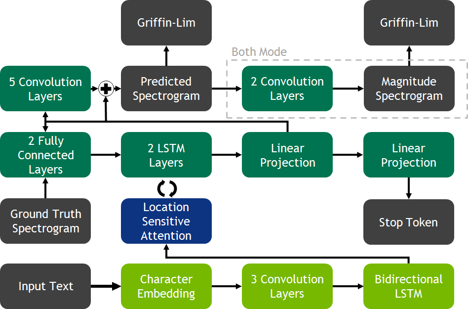

# Tacotron Implementation

## Table of contents

- [Introduction](#introduction)
- [Features](#features)
- [Installation](#installation)
- [Usage](#usage)
- [Model Structure](#model-structure)
- [Training](#training)
- [Inference](#inference)
- [References](#references)
- [Licence](#license)


## Introduction
This repository contains an implementation of the Tacotron text-to-speech model from scratch. This implementation follows the structure and principles described in the original paper by Wang et al., with some modifications and improvements.

**!Check out the generated samples in `samples` folder**


## Features
- End-to-end text-to-speech synthesis
- Mel-spectrogram generation
- Griffin-Lim vocoder for waveform synthesis
- Support for custom datasets


## Installation
Clone the repository, and install the required dependencies:

```bash
git clone https://github.com/dykyivladk1/tacotron.git
cd tacotron
pip install -r requirements.txt
```

**Ensure you have the necessary libraries installed. The main dependencies are**:
- PyTorch
- Numpy
- Librosa
- Matplotplib

## Model Structure



1. **Frontend**
    - Text Normalization
    - Token Embedding
2. **Encoder**
    - CBHG(Convolutional Banks, HighWay Networks, Bidirectional GRU)
3. **Attention Mechanism**
    - Bahdanau Attention
4. **Decoder**
    - PreNet
    - Autoregressive GRU Layers
    - Linear Projection Layer
5. **Waveform Synthesis**
    - Griffin-Lim Algorithm of Neural Vocoder


## Usage

**In order to train the model for custom dataset, prepare the data in the following format**

- `data/`: Contains all files
    - `.wav`: all wav files
    - `metadata.csv`: contains all the text transcripts and audio file names

The `metadata.csv` should have the following format:

```bash
filename|transcription
```

#### Preprocessing

Run the preprocessing script to convert audio files into mel-spectrograms:

```bash
python source/prepare_data.py --data-dir data --output_dir processed_data --metadata_file metadata.csv --config-path config.json --num-jobs 4
```

After run the `split` file for splitting the dataset into training and testing datasets:

```bash
python source/split.py --metadata metadata.txt
```

The `metadata.txt` is the file, containing the indexes of all files.

#### Training

```bash
python source/train.py 
```
For configuring the training parameters, change the `config/config.yaml` and for setting different number of epochs, change the variable `EPOCHS` to a desired number.


#### Inference the model 

```bash
python source/inference.py --checkpoint-path weights/checkpoint_step165000.pth --text "Thanks for your attention"
```

The generated audio file is saved in `samples` folder.

## References 

Wang, Y., Skerry-Ryan, R. J., Stanton, D., Wu, Y., Weiss, R. J., Jaitly, N., Yang, Z., Xiao, Y., Chen, Z., Bengio, S., Le, Q., Agiomyrgiannakis, Y., Clark, R., & Saurous, R. A. (2017). Tacotron: Towards End-to-End Speech Synthesis. arXiv. [https://arxiv.org/abs/1703.10135](https://arxiv.org/abs/1703.10135)

## License

This project is licensed under the MIT License - see the [LICENSE](LICENSE) file for details.


**Thanks for attention!**
